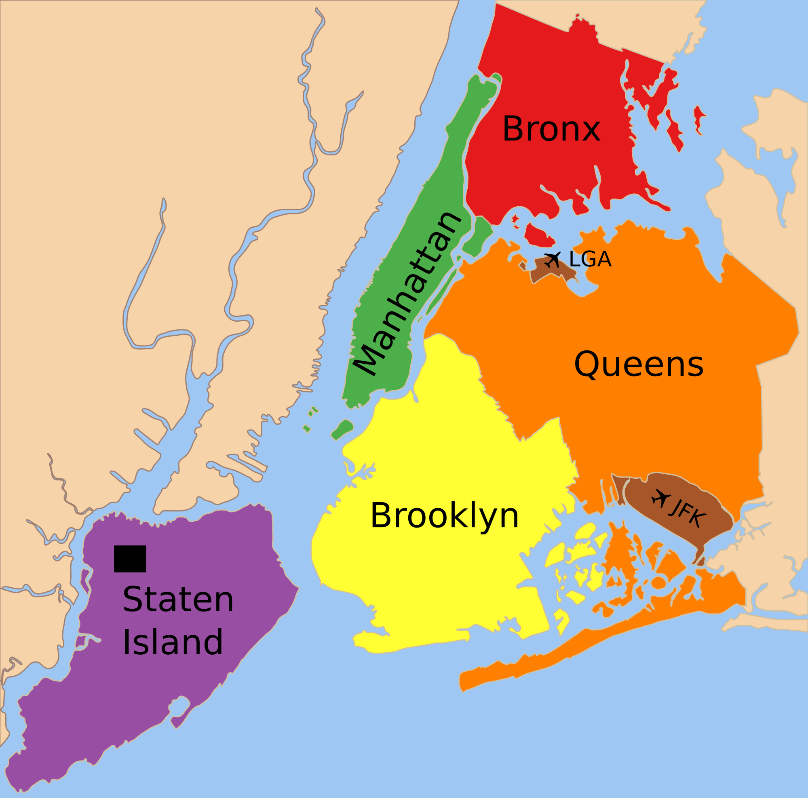

<h6 style="text-align: center;" markdown="1">By: Shiwei Chen (sc4935)  |  Shiyin Li (sl5010)  |  Weize Sun (ws2646)  |  Wenyu (wz2591)  |  Yiming Li (yl4925)</h6>

<h1><b>
Introduction
</b></h1>

  In the 1980s, New York was one of the most crime-ridden cities in the United States. From the 1990s to the 2010s, the crime rate of NYC dropped sharply. Nowadays, NYC has become one of the lowest crime rates of major cities in the US.

  As the brand new residents of NYC, we would like to explore the security situation and stability of this city. In addition, analyzing crime data from NYPD might raise the safety awareness of the victim population as well as other citizens and visitors, thus they can avoid high-crime areas.
Finally, our project also could provide housing and daily travel advice to our classmates and alumni.

